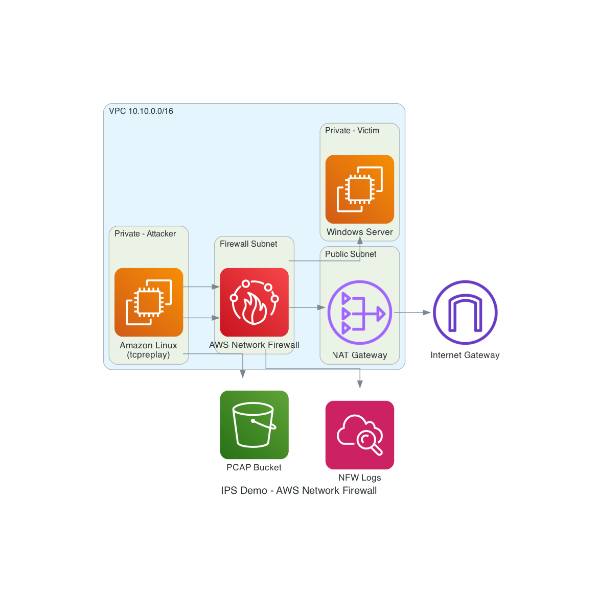
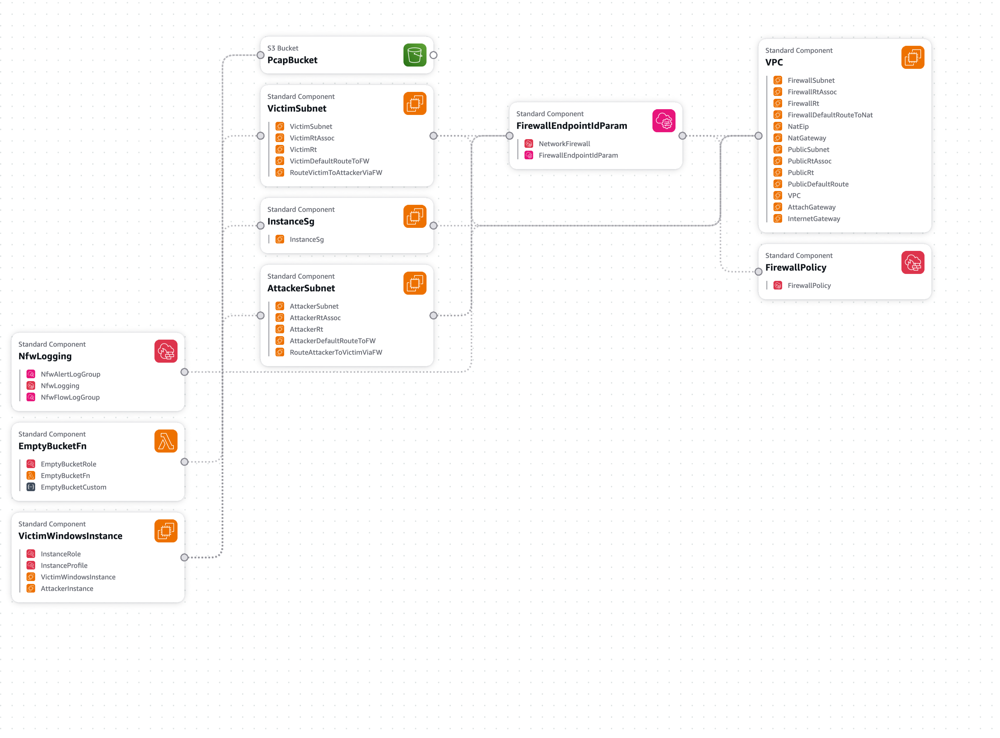

# Showcase TrendAI Vision One Cloud IPS

## Table of contents
- [Requirements](#requirements)
- [Deployment](#deployment)
- [Demo](#demo)
- [Cleanup](#cleanup)

## Requirements

- AWS account with permissions to create VPC, EC2, Network Firewall, S3, and CloudWatch resources
- Collection of PCAP files to showcase detections
- [Optional] Configured AWS CLI with appropriate credentials and region (e.g. us-east-1) if CLI commands will be used within the caurse of the demo.
- [Optional] Git CLI
## Deployment


### Deploy CloudFormation Template
Infrastructure diagram:


Download ips.yaml from <a href="https://github.com/mpkondrashin/cdemo/tree/main/ips">GitHub</a> or use git CLI:
```bash
git clone https://github.com/mpkondrashin/cdemo.git
```
Then go to the folder `ips`

#### Using CLI:
Run the following command to deploy the stack:
```bash
aws cloudformation deploy \
  --stack-name ips-demo \
  --template-file ips.yaml \
  --capabilities CAPABILITY_NAMED_IAM
```

And wait for the stack to be created (this may take a few minutes).

Note: Any other name can be used for the stack, but it should be consistent with the rest of the documentation.

#### Using Console:
1. Go to AWS CloudFormation Console
2. Click `Create stack` ➔ `With new resources (standard)` ➔ `
Upload a template file` ➔ `Choose file`
3. Upload the `ips.yaml` template ➔ `Next` button
4. Choose `Stack name` = "ips-demo"
5. Rest of the parameters can be left with their default values ➔ `Next`
6. `Capabilities` ➔ check `I acknowledge that AWS CloudFormation might create IAM resources with custom names.` ➔ `Next` button
5. Click `Submit`
6. Wait for the stack to be created (this may take a few minutes)

Resulting infrastructure:


Go to `Stacks` ➔ `ips-demo` ➔ `Outputs`

On the AWS CloudFormation console check outputs of the stack to get the S3 bucket name (`PcapBucketName`)and other information.

### Configure Network Firewall
#### Subscribe to TrendAI Vision One™ Cloud IPS
1. On the AWS console Marketplace
2. Go to `Discover products` ➔ `Search AWS Marketplace products` = TrendAI
3. Click on  `TrendAI Vision One™ Cloud IPS` ➔ `View purchase options` 
4. Click `Subscribe` Button on the bottom of the screen.
5. Go to `Manage subscriptions` on the left menu and make sure that you have `TrendAI Vision One™ Cloud IPS` on the list.

**Note:** At this stage the Stack must be deployed

#### Configure NFW Policy
1. On AWS Console go to `VPC`
2. On the left side go to `Network Firewall` ➔ `Firewall policies`
3. Click on `ips-demo-policy-ips-demo` (the last part of the name is the name of the created stack)
4. Go to `Stateful rule groups` -> `Actions` -> `Add partner managed rules groups`
5. Find `TrendAI Vision One™ Cloud IPS` and check it
6. Click `Add to policy` button

Add the TrendAI Vision One IPS rule group to the policy

### Upload pcaps.zip
pcaps.zip file can be uploaded using AWS console or CLI

#### AWS console option
1. `pcaps.zip` should be provided by the user. It should be just a zip file with any amount of `.pcap` files inside.
2. Go to S3
3. Upload the `pcaps.zip` file to the S3 bucket created by the CloudFormation stack
#### CLI option
Use the following CLI command 
```bash
aws s3 cp pcaps.zip s3://<bucket name>/
```

**Note:** PCAP files collection is not provided using this demo, but you can drop me a line ;)

## Demo

### Generate alerts
1. On AWS console go to `EC2`
2. Go to `Instances` -> `ips-demo-attacker` -> Click instance id
3. Push `Connect` button
4. Go to `SSM Session Manager` and push `Connect` button 
5. In the session manager console run the following commands:
```bash
sudo bash
sudo replay_pcaps.sh
```
If `pcaps.zip` file has password, you will be prompted to enter it. It is usually "infected" or "virus".

### Check the logs

1. On AWS console go to CloudWatch
2. Go to `Logs` ➔ `Log Management` ➔ `Log Groups`
3. Find the log group with the name `/aws/network-firewall/ips-demo/flow` and `/aws/network-firewall/ips-demo/alert` 
4. Click on the log stream
5. You should see the logs from the IPS

In case you prefer CLI:
```bash
aws logs filter-log-events \
  --log-group-name /aws/network-firewall/ips-demo/alert
```

## Cleanup

To cleanup infrastructure after demo, CloudFormation stack should be deleted and Cloud IPS subscription canceled.
### Delete CloudFormation Stack
Use CLI or AWS console

#### CLI option
Use the following commands
```bash
aws cloudformation delete-stack --stack-name ips-demo
aws cloudformation wait stack-delete-complete --stack-name ips-demo
```

#### AWS console option
1. Go to AWS CloudFormation Console
2. Choose previously created stack
3. Choose "Delete stack"
4. Confirm the deletion


### Cancel TrendAI Cloud IPS subscription

1. On AWS console go to `AWS Marketplace` ➔ `Manage subscriptions`
2. Click on `TrendAI Vision One™ Cloud IPS` subscription ID
3. Click on `Actions` ➔ `Cancel subscription` 

